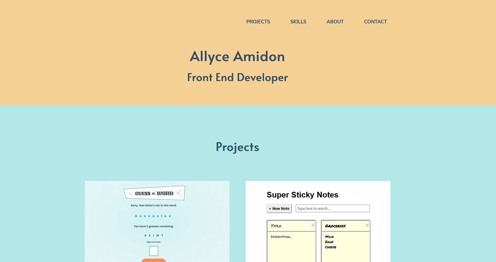

# Allyce Amidon Portfolio 

## Table of contents

- [Overview](#overview)
  - [Screenshot](#screenshot)
  - [Links](#links)
- [My process](#my-process)
  - [Built with](#built-with)
  - [Continued development](#continued-development)
- [Author](#author)
- [Acknowledgments](#acknowledgments)

**Note: Delete this note and update the table of contents based on what sections you keep.**

## Overview

### Screenshot

### Links

- Code URL: [https://github.com/amidona/portfolio](https://github.com/amidona/portfolio)
- Live Site URL: [https://allyceamidon.com/](https://allyceamidon.com/)

## My process

### Built with

- Semantic HTML5 markup
- Flexbox
- Mobile-first workflow
- Responsive web design

### Continued development

Since I already have a searchable GitHub repo gallery made, I'd like to link the skills so clicking on them takes you to a list of applicable projects.

## Author

- Website - [Allyce Amidon](https://allyceamidon.com/)
- GitHub - [@amidona](https://github.com/amidona)

## Acknowledgments

Thanks to [Skillcrush](https://skillcrush.com/) for making this possible!
